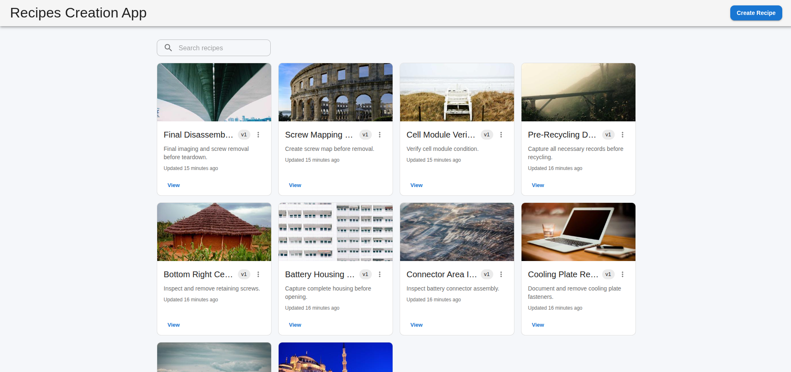
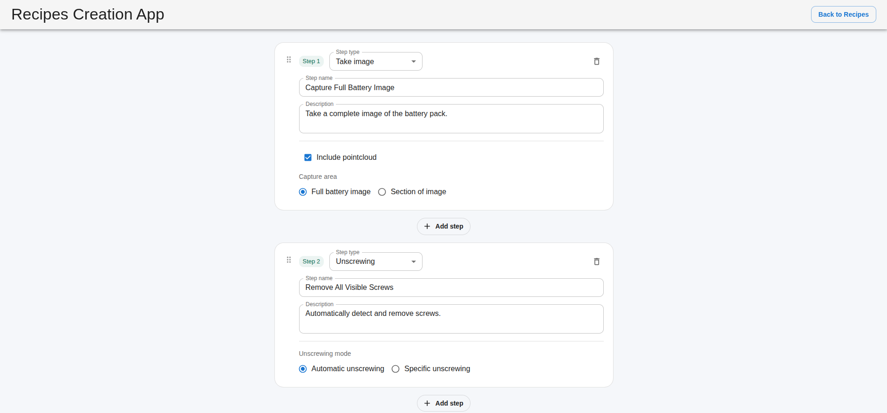

# Recipe Creation App

To streamline the process of creating automation recipes, this application enables quick and efficient recipe creation with minimal complexity. It integrates with automation robots, facilitating the generation and exchange of recipes, and provides flexibility and efficiency in recipe development.

A **recipe** is a set of instructions that a robotic arm follows to complete tasks — from recognizing and unscrewing screws, to capturing images of various components of a battery.

---

## Tech stack

| Layer | Technology |
|---|---|
| Backend | Python, FastAPI, SQLAlchemy, Alembic |
| Database | PostgreSQL |
| Frontend | React (Vite), MUI, React Query, react-beautiful-dnd |

---

## Project structure

```
.
├── backend/
│   ├── app/
│   │   ├── main.py            # FastAPI app entrypoint
│   │   ├── config.py          # Settings (reads .env)
│   │   ├── database.py        # SQLAlchemy engine/session setup
│   │   ├── models.py          # ORM models (Recipe, Step, step detail tables)
│   │   ├── crud.py             # Database operations
│   │   ├── schemas/            # Pydantic request/response schemas
│   │   └── routers/
│   │       └── recipes.py      # Recipe + step CRUD endpoints
│   ├── alembic/                 # Database migrations
│   ├── alembic.ini
│   ├── requirements.txt
│   ├── .env.example
│   └── docker-compose.yml       # PostgreSQL container
│
└── frontend/
    ├── src/
    │   ├── components/
    │   │   └── RecipeCard.tsx
    │   ├── pages/
    │   │   ├── RecipeCreatePage.tsx
    │   │   ├── RecipeListPage.tsx
    │   │   └── RecipeViewPage.tsx
    │   ├── models/
    │   │   └── recipe.ts
    │   └── App.tsx
    ├── index.html
    ├── package.json
    └── vite.config.ts
```

---

## Getting started

### Prerequisites

- Python 3.10+
- Node.js 18+ and npm
- Docker (for PostgreSQL), or a local PostgreSQL instance

### 1. Clone the repository

```bash
git clone <repository-url>
cd recipe-creation-app
```

### 2. Run the whole stack with Docker Compose

Create a `.env` file in the repository root (example):

```
DB_USER=recipe_user
DB_PASS=recipe_pass
DB_NAME=recipe_db
DB_PORT=5432
FRONTEND_PORT=3000
```

Start services:

```bash
docker-compose up --build -d
```

View logs and status:

```bash
docker-compose ps
docker-compose logs -f backend
```

Access:

- Backend API and docs: `http://localhost:8000/api/v1` (Swagger UI: `/docs`)
- Frontend: `http://localhost:${FRONTEND_PORT:-3000}`

Stop and remove:

```bash
docker-compose down
```

---

## API documentation

Full interactive documentation is available via Swagger UI at `/docs` once the backend is running. Summary of the main endpoints:

### Recipes

| Method | Endpoint | Description |
|---|---|---|
| `GET` | `/recipes` | List recipes (supports `search`, `page`, `page_size` query params) |
| `POST` | `/recipes` | Create a new recipe, optionally with an initial list of steps |
| `GET` | `/recipes/{recipe_id}` | Get a single recipe with all its steps |
| `PATCH` | `/recipes/{recipe_id}` | Update recipe metadata (`name`, `description`) |
| `DELETE` | `/recipes/{recipe_id}` | Delete a recipe and all its steps |
| `GET` | `/recipes/{recipe_id}/validate` | Validate a recipe's structure and step properties |

### Steps

| Method | Endpoint | Description |
|---|---|---|
| `POST` | `/recipes/{recipe_id}/steps` | Add a single step to a recipe |
| `DELETE` | `/recipes/{recipe_id}/steps/{step_id}` | Remove a single step from a recipe |
| `PUT` | `/recipes/{recipe_id}/steps/order` | Reorder existing steps |
| `PUT` | `/recipes/{recipe_id}/steps` | Replace the entire step list (used for full recipe edits / imports) |

### Step types and properties

**Take image**

| Property | Type | Notes |
|---|---|---|
| `include_pointcloud` | boolean | |
| `image_scope` | `"full_battery"` \| `"section"` | |
| `center_x`, `center_y` | integer (≥ 0) | Required only when `image_scope` is `"section"` |

**Unscrewing**

| Property | Type | Notes |
|---|---|---|
| `unscrewing_mode` | `"automatic"` \| `"specific"` | |
| `coordinate_x`, `coordinate_y` | integer (≥ 0) | Required only when `unscrewing_mode` is `"specific"` |

### Error responses

The API returns standard HTTP status codes with a JSON body containing a `detail` field describing the error:

| Status | Meaning |
|---|---|
| `400` | Invalid request (e.g. failed validation, integrity constraint violation) |
| `404` | Recipe or step not found |
| `422` | Request body failed schema validation (handled automatically by FastAPI/Pydantic) |

---

## Database schema

The schema follows a class-table inheritance pattern:

- **`recipes`** — top-level recipe metadata (`name`, `description`, `version`, timestamps)
- **`steps`** — ordered list of steps belonging to a recipe (`step_type`, `order_index`, `name`, `description`, `image_url`)
- **`take_image_steps`** — type-specific properties for "Take image" steps, 1:1 with `steps`
- **`unscrewing_steps`** — type-specific properties for "Unscrewing" steps, 1:1 with `steps`

Database-level `CHECK` constraints enforce non-negative coordinates and that coordinates are present only when the relevant scope/mode requires them.

---

## Recipe import/export

A recipe can be exported as JSON via `GET /recipes/{recipe_id}` and downloaded from the frontend's recipe view page. The same JSON shape (matching the `RecipeCreate`/`RecipeOut` schema) can be re-imported by creating a new recipe via `POST /recipes`, or by loading it into the editor and saving via `PUT /recipes/{recipe_id}/steps`.

---

## Running migrations

When the schema changes, generate a new migration and apply it:

```bash
cd backend
alembic revision --autogenerate -m "describe your change"
alembic upgrade head
```

---

## Screenshots

> _Add screenshots of the recipe list, recipe creation/editing page, and step configuration here._

| Recipe list | Recipe editor |
|---|---|
|  |  |

---

## Future improvements

- Diff-based step updates to preserve step IDs across edits
- Authentication and per-user recipe ownership
- Recipe versioning/history with rollback
- Pagination on the frontend recipe grid